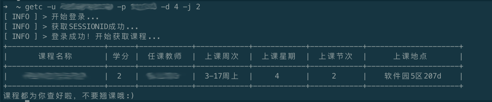

# 查课表的命令行工具 getc

## 安装

所有的步骤都假设你已经安装了git和npm

首先将项目克隆下来
```shell
git clone https://github.com/sevenddddddd/sdu-getc.git
```

然后进入目录，并全局安装
```shell
cd sdu-getc
npm install . -g
```

安装完毕之后，你就可以直接在命令行中使用getc了

## 用法

基本用法
```shell
getc -u <你的学号> -p <你的教务密码>
```

输出示例


参数

* ```-u xxx``` 
  
  学号

* ```-p xxx``` 
  
  教务

* ```-d xxx``` 
  
  设置查询的周数，xxx为1位以上的数字，每个数字对应一天，且每个数字必须为1-7中的一个。重复输入的数字会被忽略。

  例：```getc -u <你的学号> -p <你的教务密码> -d 123```会为你查询你周一、周二、周三的课程。

  该参数默认值是1234567，即在不设置该参数时会查询周一到周日的课程。

* ```-j xxx``` 
  
  设置查询的节数，xxx为1位以上的数字，每个数字对应一节，且每个数字必须为1-5中的一个。重复输入的数字会被忽略。

  例：```getc -u <你的学号> -p <你的教务密码> -j 123```会为你查询你第一、二、三节的课程。

  该参数默认值是12345，即在不设置该参数时会查询一天内所有的课程。

  **以上四个参数，-p和-u是必需的，其余两个是可选的。这四个参数可以任意顺序组合。**
  ****
  **以下两个参数只能单独使用，并且必须放在第一位，如```getc -v```**

* ```-v```

  显示版本信息

* ```-h```

  显示帮助信息